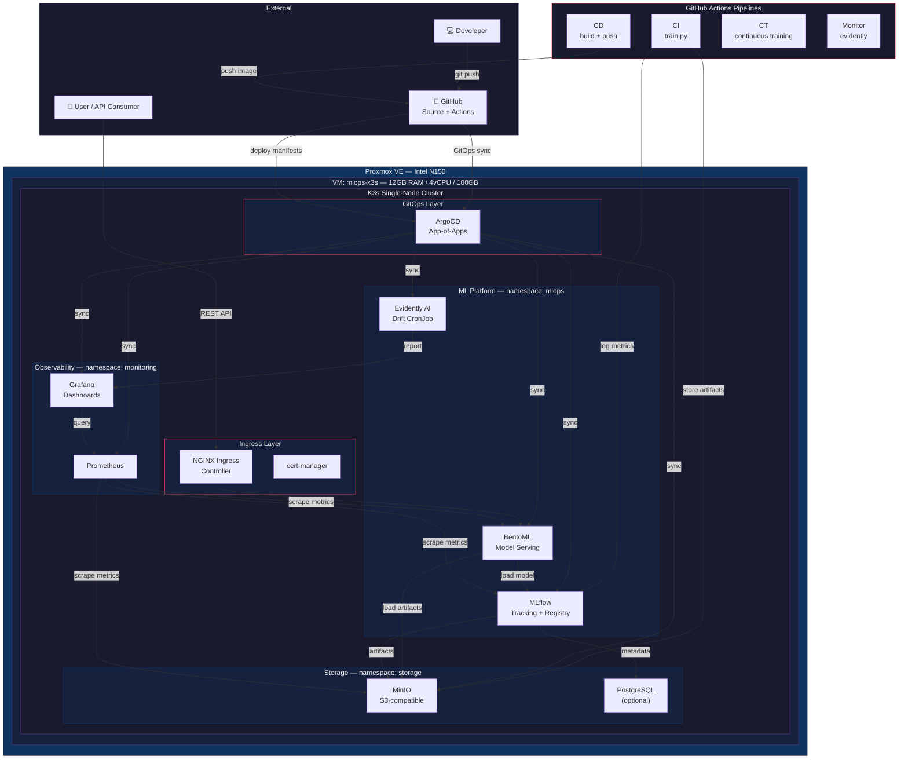

# MLOps Platform — Architecture Diagram



## Key Components

| Component | Tool | Purpose |
|-----------|------|---------|
| **Provisioning** | Terraform + Proxmox | VM creation, cloud-init, reproducible infra |
| **Orchestration** | K3s | Lightweight Kubernetes cluster |
| **GitOps** | ArgoCD | Declarative sync from GitHub, auto-heal |
| **Tracking** | MLflow | Experiment tracking, parameter logging, metrics |
| **Registry** | MLflow Model Registry | Model versioning, stage transitions |
| **Storage** | MinIO | S3-compatible object store for artifacts |
| **Serving** | BentoML | Production inference API with HPA |
| **Monitoring** | Evidently AI | Data drift detection, data quality reports |
| **Observability** | Prometheus + Grafana | Metrics, dashboards, alerting |
| **CI/CD/CT** | GitHub Actions | Train, build, deploy, continuous training |
| **Database** | PostgreSQL | MLflow metadata store (optional) |
| **Ingress** | NGINX + cert-manager | HTTP routing, TLS certificates |

## Data Flow

```
1. Developer pushes code → GitHub
2. GitHub Actions triggers CI pipeline → trains model → logs to MLflow
3. MLflow stores artifacts in MinIO, metadata in PostgreSQL
4. ArgoCD detects manifest changes → syncs cluster state
5. BentoML loads model from MLflow → serves predictions
6. User calls REST API → NGINX routes to BentoML
7. Prometheus scrapes metrics from all services
8. Grafana displays dashboards with real-time metrics
9. Evidently CronJob runs daily → checks for data drift
10. Continuous Training pipeline retrains if drift detected
```
